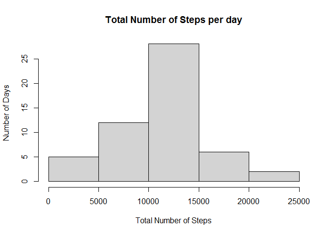
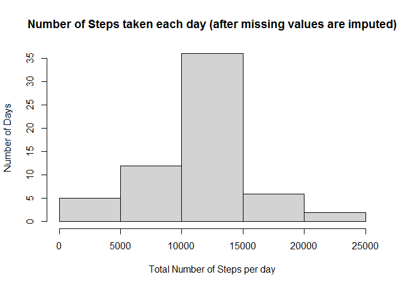
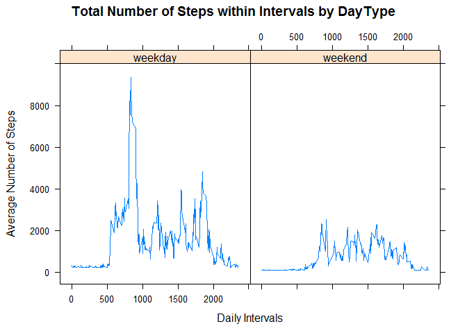

## A. Code for reading in the dataset and/or processing the data

### 1. Load the data (i.e. read.csv())
This step will download the file from the instructor's git repo and unzip into your working directory

```r
# Download the file
if(!file.exists("activity.zip")) {
  temp <- tempfile()
  download.file("https://github.com/rdpeng/RepData_PeerAssessment1/raw/master/activity.zip",temp)
  # Extract the contents
  unzip(temp)
  unlink(temp)
}

# Load the file into variable
activity<-read.csv("activity.csv")
```

### 2. Process/transform the data (if necessary) into a format suitable for your analysis
Transforming character field date into Date format

```r
activity$date <- as.Date(as.character(activity$date),"%Y-%m-%d")
str(activity)
```

```
## 'data.frame':	17568 obs. of  3 variables:
##  $ steps   : int  NA NA NA NA NA NA NA NA NA NA ...
##  $ date    : Date, format: "2012-10-01" "2012-10-01" ...
##  $ interval: int  0 5 10 15 20 25 30 35 40 45 ...
```


## B. What is mean total number of steps taken per day?
Let's follow the below steps

### 1. Calculate the total number of steps taken per day


```r
totalStepsByDay<-aggregate(steps~date, activity, sum)
```

### 2. Make a histogram of the total number of steps taken each day

```r
hist(totalStepsByDay$steps, xlab="Total Number of Steps", ylab="Number of Days", main="Total Number of Steps per day")
```

<!-- -->

### 3.Calculate and report the mean and median of the total number of steps taken per day

```r
# Mean of steps taken per day
mean(totalStepsByDay$steps, na.rm = TRUE)
```

```
## [1] 10766.19
```

```r
# Median of steps taken per day
median(totalStepsByDay$steps, na.rm = TRUE)
```

```
## [1] 10765
```

## C. What is the average daily activity pattern?
Let's follow the below steps
1.Make a time series plot (i.e. 𝚝𝚢𝚙𝚎 = “𝚕”) of the 5-minute interval (x-axis) and the average number of steps taken, averaged across all days (y-axis)  


```r
# The average number of steps taken:
averageStepsbyInterval<-aggregate(steps~interval, activity, mean)

# Time series plot of the average number of steps taken:
with(averageStepsbyInterval, plot(interval, steps, type = 'l'))
```

<!-- -->

2.Which 5-minute interval, on average across all the days in the dataset, contains the maximum number of steps?


```r
averageStepsbyInterval[which.max(averageStepsbyInterval[,2]),1]
```

```
## [1] 835
```

## D. Imputing missing values
Let's follow the below steps

### 1. Total number of missing values in the dataset


```r
missingIndex<-is.na(activity[,1])
#print Total missing value
sum(missingIndex)
```

```
## [1] 2304
```

### 2. Replace missing values
Using mean as the filling option for missing values


```r
m_mean <- mean(averageStepsbyInterval$steps)
m_mean
```

```
## [1] 37.3826
```
The missing values will be replaced by the above value

### 3. Create a new dataset that is equal to the original dataset but with the missing data filled in.


```r
activity_new <- activity
activity_new[missingIndex, 1] <- m_mean
head(activity_new)
```

```
##     steps       date interval
## 1 37.3826 2012-10-01        0
## 2 37.3826 2012-10-01        5
## 3 37.3826 2012-10-01       10
## 4 37.3826 2012-10-01       15
## 5 37.3826 2012-10-01       20
## 6 37.3826 2012-10-01       25
```

### 4. Impact of imputing missing data
  *a. Make a histogram of the total number of steps taken each day*
  

```r
totalStepsByDay_new<-aggregate(steps~date, activity_new, sum)
hist(totalStepsByDay_new$steps, xlab="Total Number of Steps per day", ylab="Number of Days", main="Number of Steps taken each day (after missing values are imputed)")
```

<!-- -->

  *b. To calculate the mean and median total number of steps per day with new dataset*
  

```r
# Mean after imputing missing values
mean(totalStepsByDay_new$steps)
```

```
## [1] 10766.19
```

```r
# Median after imputing missing values
median(totalStepsByDay_new$steps)
```

```
## [1] 10766.19
```

*The mean remains the same while a slight change is observed in the median.*

## E. Are there differences in activity patterns between weekdays and weekends?
Lets follow the below steps:

### 1. Create a new factor variable in the dataset with two levels – “weekday” and “weekend” indicating whether a given date is a weekday or weekend day.


```r
# create a variable with weekdays name
activity_new$weekday <- weekdays(activity_new$date)
# create a new variable indicating weekday or weekend
activity_new$DayType <- ifelse(activity_new$weekday=='Saturday' | activity_new$weekday=='Sunday', 'weekend','weekday')
# see first 6 (default) values
head(activity_new)
```

```
##     steps       date interval weekday DayType
## 1 37.3826 2012-10-01        0  Monday weekday
## 2 37.3826 2012-10-01        5  Monday weekday
## 3 37.3826 2012-10-01       10  Monday weekday
## 4 37.3826 2012-10-01       15  Monday weekday
## 5 37.3826 2012-10-01       20  Monday weekday
## 6 37.3826 2012-10-01       25  Monday weekday
```

### 2. Average number of steps taken averaged across all weekdays and weekends
Make a panel plot containing a time series plot i.e (type = 'l') of the 5-minute interval (x-axis) and the average number of steps taken, averaged across all weekday days or weekend days (y-axis). 


```r
library(dplyr)
```

```
## Warning: package 'dplyr' was built under R version 4.0.3
```

```
## 
## Attaching package: 'dplyr'
```

```
## The following objects are masked from 'package:stats':
## 
##     filter, lag
```

```
## The following objects are masked from 'package:base':
## 
##     intersect, setdiff, setequal, union
```

```r
averageStepByDayTypeAndInterval<-activity_new %>%
                                  group_by(DayType, interval) %>%
                                   summarize(averageStepByDay=sum(steps))
```

```
## `summarise()` regrouping output by 'DayType' (override with `.groups` argument)
```
Make panel plot


```r
library(lattice)
with(averageStepByDayTypeAndInterval, 
      xyplot(averageStepByDay ~ interval | DayType, 
      type = "l",      
      main = "Total Number of Steps within Intervals by DayType",
      xlab = "Daily Intervals",
      ylab = "Average Number of Steps"))
```

<!-- -->


